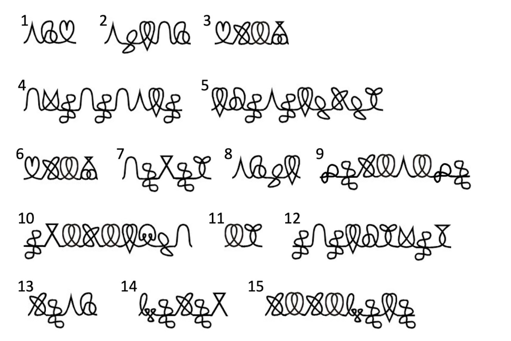

The Avoiuli writing system is used on Pentecost Island in Vanuatu, a Pacific island country (near the center of
the map below). With a design inspired by traditional sand drawings, Avoiuli was developed over fourteen
years by Chief Viraleo Boborenvanua, as part of a movement he leads to revitalize Vanuatuan culture and
language.

One of the languages that Avoiuli is used for is Bislama, one of the official languages of Vanuatu. As you will
see, Bislama is a creole language[^1]
– many of its words come from English, some come from French, and
others from the indigenous languages of Vanuatu.

Below is a sign written in Bislama, using the Avoiuli script, on the front of a college on Pentecost Island. For
the purposes of this problem, each of the words in the script below has been allotted a number:

**A1.** Give the number of a word (any one, if there are multiple) which corresponds to these Bislama words:

> a. filosofi :ans 
b. institiut :ans
c. blong :ans

**A2.** Give the number of a word (any one, if there are multiple) which means:

> a. village :ans
b. center :ans
c. teach(ing) :ans
d. technology :ans
e. humanity :ans

**A3.** Which geographical area of the Pacific is mentioned in the text on the sign?

[^1]: When multiple groups of people who speak different languages need to communicate, they often develop a simplified system
called a *pidgin*, which mixes words from their various languages but lacks the grammatical complexity of a language. When a
pidgin is taught to a new generation of children, they typically develop it into a fully complex language called a *creole*.