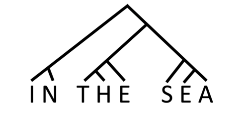

We are used to hearing sentences one word at a time. Sometimes, this can cause confusion. Think about this
sentence:

:div[Katherine believes Lydia is lying.]{.center}

If you read the sentence from left to right, you would first read *Katherine*, then *believes*, and then *Lydia*. At
this point, you would think that Katherine believes Lydia. After reading the rest of the words, you would
need to go back and fix your incorrect first impression.

Instead of receiving words one at a time, some computers take in the entire sentence at once. This approach
can help avoid the confusion illustrated above. In addition, it is often more efficient because the computer
does not have to wait while it processes one word before it can move on to the next one.

For the all-at-once approach to work, the computer needs its input to be in a representation that does not
depend on the order of its elements. In this problem, we focus on some representations of this type. To
simplify the scenario, we will only talk about sentences as sequences of letters, even though most language
technology today is based around larger units such as words. For example, a word-based system would view
“good morning” as two words (“good” and “morning”), while a letter-based system would view “good
morning” as eleven letters (“g”, “o”, “o”, “d”, “m”, “o”, “r”, “n”, “i”, “n”, and “g”).

:u[In the Bag]

One very simple representation that avoids using a sequence is called a *bag of words* (or, in our case, a bag
of letters). For example, the word GREEN would be represented as the bag of letters [E,E,G,N,R]. Note that
[E,E,G,N,R] is the same bag of letters as [G,E,N,E,R] or [G,R,E,E,N] - although these look different on the
printed page, they are the same to a bag-of-letters computer system.

Using a bag of letters can cause some confusion. Recently, Professor Eliza Shrdlu asked her computer
assistant to prepare dinner for an enormous party. The computer asked how many people were attending,
and Professor Shrdlu answered OVERFIFTY. Unfortunately, the computer received this answer as the bag of
letters [E,F,F,I,O,R,T,V,Y], which the computer misinterpreted: it rearranged these letters to get a smaller
number than what Professor Shrdlu had intended. As a result, there was not enough food at the party for all
of the guests.

**G1.** How many people did the computer think would be at the party? You don’t need to include any
punctuation or spaces in your answer. [HINT: The answer is a number between one and fifty.]

> :ans{cl=large}

:u[Location, Location, Location]

In order to avoid this sort of confusion, we need to insert information about the order of the letters. We can
do this by annotating each letter with its position in the sequence.

**G2.** What message does the following representation encode? You don’t need to include any punctuation or
spaces in your answer.

> :ans{cl=large}

[O:16, N:17, E:7, A:21, O:11, E:20, P:10, C:18, M:4, L:19, E:3, D:6, I:15, A:5, I:1, Y:9, S:12, V:2, M:8, T:14, R:22, I:13]

Note that, like the bag of letters, the representation at the bottom of the previous page is still not a sequence: the order of the letters must be inferred from the numbers they are associated with, not from the order that the letters appear on the page. The representation would not be changed if we rearranged it as
[P:10, E:20, O:11, A:21, Y:9, I:13, T:14, O:16, N:17, I:1, R:22, D:6, M:4, A:5, L:19, V:2, E:3, C:18, E:7, I:15, S:12,
M:8]. In other words, this representation provides sequential *information* without sequential *structure*.

**G3.** There are other possible ways to represent linear position besides the approach shown in G2. What
message does the following representation encode? You don’t need to include any punctuation or spaces in
your answer.

[6\:U, 4\:P, 10\:B, 1\:N, 9\:A, 5\:P, 2\:A, 7\:K, 3\:L, 8\:C]

> :ans{cl=large}

:u[Barking Up the Right Tree]

In linguistics, words and phrases are usually analyzed using a tree structure rather than a sequential
structure. For example, we might use the following tree for IN THE SEA:

:div[]{style="width: 50%; margin: auto;"}

Another way to represent the tree shown above is [E\:RRRL, A\:RRRR, H\:RLLR, I\:LL, T\:RLLL, S\:RRL, N\:LR, E\:RLR].

**G4.** What message does the following representation encode? You don’t need to include any punctuation or
spaces in your answer.

[T\:RR, N\:LRRL, A\:LLRL, U\:RLR, R\:LLLR, H\:LLRRRR, B\:LLLL, C\:LLRRRL, O\:RLL, N\:LLRRL, G\:LRRR, I\:LRL]

> :ans{cl=large}

:u[Wickelphones]

An influential paper by Rumelhart and McClelland (1986) modeled English verbs using representational units
called Wickelphones. Wickelphones are named after psychologist Wayne Wickelgren; the *phone* part of the
name refers to the fact that they were representing sounds, also known as phones. Since we are instead
using letters, we could encode a message using Wickel:u[letters]. The word BLUE represented using
Wickelletters would be [U\:L\_E, B\:#\_L, E\:U\_#, L\:B\_U].

**G5.** What message does the following representation encode? You don’t need to include any punctuation or
spaces in your answer.

[O\:I\_N, I\:T\_O, T\:N\_O, T\:A\_T, R\:U\_S, N\:U\_D, N\:E\_T, O\:T\_Y, N\:O\_T, D\:N\_I, A\:Y\_T, R\:R\_O, I\:D\_N, T\:T\_E, P\:#\_A,
E\:T\_N, Y\:O\_O, T\:N\_I, Y\:A\_A, G\:N\_S, S\:G\_#, U\:O\_N, O\:R\_U, N\:I\_G, O\:Y\_U, U\:S\_R, R\:U\_R, A\:P\_Y, U\:O\_R, S\:R\_U]

> :ans{cl=large}