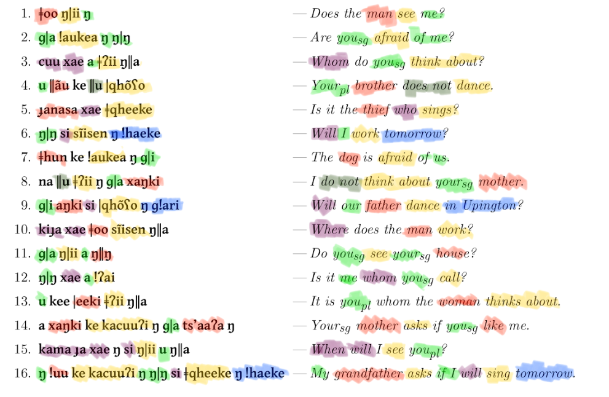

Matching terms, we get the following: 

Note that word order is preserved and conjugations/declensions do *not* exist. 

| Nǀuuki | English |
| - | - |
| ŋ / ŋǀŋ (ŋ + ke = na) | me |
| a / ɡǀa | you:sub[sg] |
| u / | you:sub[pl] |
| ɡǀi | us |
| ǂoo | man |
| ǀeeki | woman |
| ǁãu | brother |
| ɟanasa | thief |
| ǂhun | dog |
| xaŋki | mother |
| aŋki | father |
| ǃuu | grandfather |
| ŋǁŋ | house |
| ŋǀii | to see |
| ǃaukea | to be afraid of |
| ǂʔii | to think about |
| ǀqhõʕo | to dance |
| ǂqheeke | to sing |
| sĩisen | to work |
| ǃʔai | to call |
| ts’aaʔa | to like |
| cuu | whom |
| kiɟa | where |
| kama ɟa | when |
| si | will |
| ǁu | not |
| ǃhaeke | tomorrow |

particles:
- xae - question with two parts
- ke - declarative
- kee - declarative with two parts

ke kacuuʔi ŋ = asks if

ends with ŋǁa when two-part question (i.e. xae) but not yes/no, or when declarative with two parts (i.e. kee), and with ŋ otherwise

We use the ɡǀV form of a pronoun when at the beginning of a question or after ŋ.

Hence, for **(a)**:

> 17\. na kacuuʔi ŋ ɡǀu xae ŋ ǃuu ǃʔai :sol[I ask if it is you:sub[pl] whom my grandfather calls.] 
> 18\. na ǁu si sĩisen ŋ ɡǃari :sol[I will not work in Upington.] 
> 19\. ǀeeki ke ǃaukea ŋ ŋǀŋ ǂhun :sol[The woman is afraid of my dug.] 
> 20\. ŋ kee si ǃʔai a :sol[It is I who will call you:sub[sg].] 
> 21\. cuu xae u ŋǀii :sol[Whom do you:sub[pl] see?] 
> 22\. cuu xae ts’aaʔa ŋ :sol[Who likes me?] 

and **(b)**:

> 23\. Our mother will not call your:sub[sg] brother. :sol[i xaŋki ke ǁu si ǃʔai a ǁãu] 
> 24\. It is you:sub[sg] whom my dog is afraid of. :sol[a kee ŋ ǂhun ǃaukea ŋǁa] 
> 25\. Where will you:sub[pl] sing? :sol[kiɟa xae u si ǂqheeke ŋǁa] 
> 26\. I ask if it is our grandfather whom you:sub[sg] think
about. :sol[na kacuuʔi ŋ ɡǀi ǃuu xae a ǂʔii ŋǁa] 
> 27\. Who will dance tomorrow? :sol[cuu xae si ǀqhõʕo ŋ !haeke] 
> 28\. Do you:sub[pl] see us? :sol[gǀu ŋǀii i] 