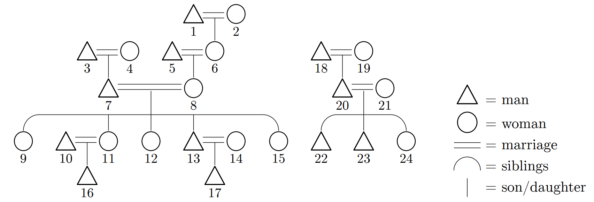

Here are the family trees of two families of Arabana speakers. In
these trees, siblings are arranged from oldest to youngest going from left to right:

Now here are utterances from 22 of these people describing their relationships to some of
their relatives:

| Person (A-X) | Relationships | Person (A-X) | Relationships | Person (A-x) | Relationships |
| - | - | - | - | - | - |
| A | D anthunha wardu. F anthunha **(i)** :ans . | H | N anthunha piyaka. O anthunha **(iii)** :ans . W anthunha **(iv)** :ans . | P | H anthunha nhupa. I anthunha **(vii)** :ans . V anthunha lhuka. |
| C | B anthunha kupaka. D anthunha apityi. E anthunha kupaka. G anthunha lhuka. | J | H anthunha apityi. L anthunha  **(v)** :ans . | R | H anthunha thanti. |
| B | C anthunha nhuthi. D anthunha apityi. E anthunha nhuthi. G anthunha lhuka. | I | V anthunha piyaka. |  S | J anthunha thanti. L anthunha thanti. V anthunha nhupa. |
| D | A anthunha lhuka. B anthunha piyaka. E anthunha  **(ii)** :ans . G anthunha nhupa. | K | P anthunha **(vi)** :ans . | T | J anthunha kaku. L anthunha nhuthi. N anthunha kaku. S anthunha thanti. | 
| E | B anthunha kupaka. C anthunha nhuthi. G anthunha lhuka. | L | K anthunha piyaka. U anthunha kaku. V anthunha kadnhini. W anthunha kadnhini. | U | J anthunha kupaka. R anthunha **(viii)** :ans . V anthunha kadnhini. |
| F | A anthunha nhupa. | M | K anthunha wardu. L anthunha nhupa. | V | N anthunha kadnhini. P anthunha wardu. Q anthunha **(ix)** :ans . T anthunha kadnhini. |
| G | C anthunha wardu. E anthunha wardu. | O | H anthunha wardu. T anthunha amanyi. W anthunha nhupa. | W | N anthunha kadnhini. | 
| | | | | X | U anthunha nhupa. |

**(a)** Match the family members A–X with their positions (1–24) on the family trees.

:match{num=24, alpha=true}

**(b)** Fill in the blanks (i–ix).

**Note.** Arabana belongs to the Pama–Nyungan family. It is spoken by approx. 15 people in the
state of South Australia.
In this problem, each person is referred to with a single letter for convenience, but examples
of Arabana names include **Wanga-mirri** ‘many mornings’, **Palku-nguyu-thangkayiwanha** ‘one
bank of cloud sitting down temporarily’ and **Kutha-kiRanangkarda** ‘water ever flowing’.
 **dnh**, **lh**, **ng**, **nh**, **ny**, **R**, **rd**, **rr**, **th**, **ty**, **w** and **y** are consonants. :i[—Tom McCoy]{.right}