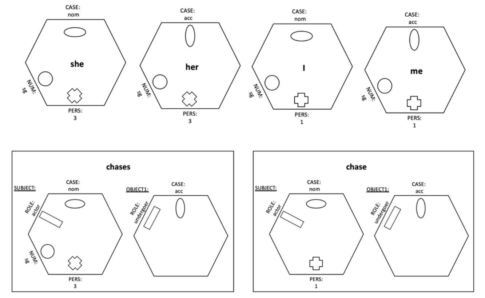
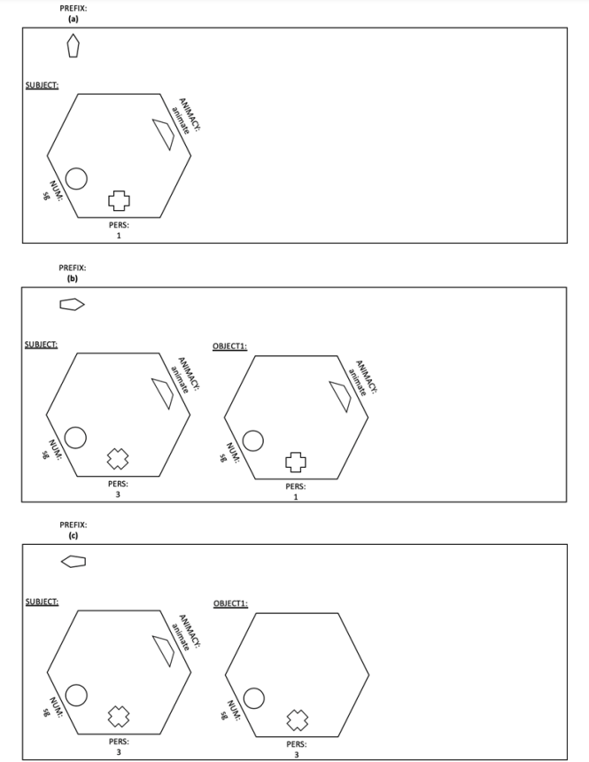
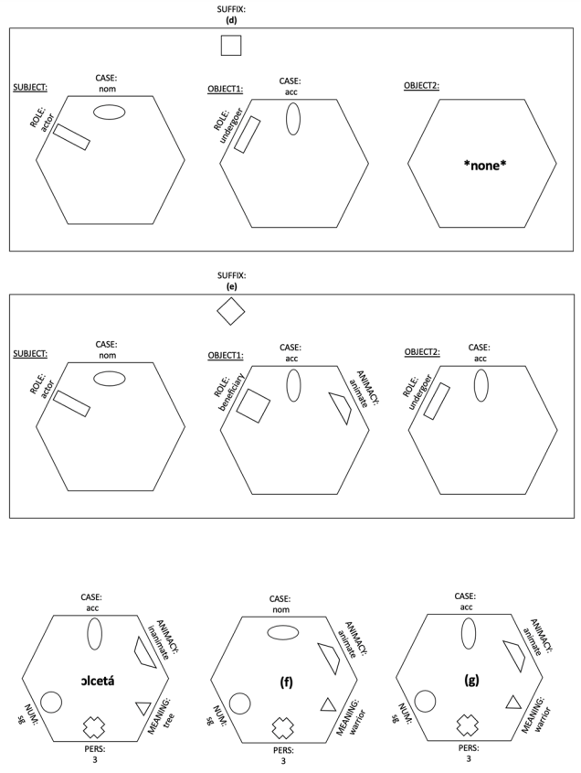

One way for computers to understand language is to form structures that show how words in a sentence
relate to each other. Unification Grammar is one way to build such structures. The structures of words are
combined to make the structures of sentences. Here are the structures for the words *she*, *her*, *I*, *me*, *chases*,
and *chase* in Unification Grammar:

You can do this problem without knowing words like CASE, NUM(ber), PERS(on), SUBJECT, and OBJECT. In
fact, if you know what these words mean, be careful because linguists define them in a special way. However, the words *actor* and *undergoer* are important to this problem; the actor does something, and something
happens to the undergoer.

:u[**How to make a sentence with Unification Grammar**]
 Unify (combine) the structures for nouns with the SUBJECT and OBJECT structures of verbs. Visually, this
works by placing the structures for the words being unified on top of each other. Unification only works
when all of the information is compatible. For example, on the left at the top of the next page, you can see
the unified structure for *I chase her*, which is a successful unification. However, on the right, you can see that
you cannot unify *I chases her* because the PERS feature for *I* clashes with the PERS feature for the subject of
*chases*.

The unification grammar does two things: (1) when we build a structure, we can see who (actor) chases who
(undergoer) (for example, in the structure on the left above, we can see that the actor is *I* and the undergoer
is *her*); and (2) if we cannot build a structure, we know that there is no English sentence that combines those
words in that particular way (as is the case with *I chases her* on the right above).

:u[**Unification Grammar for Maasai[^1] words**]
 Now you will work with a unification grammar for the Maasai language. There are three new things in the
Maasai grammar, (1) There is a new ROLE, *beneficiary*, indicating for *someone*, (2) Some structures have OBJECT1 and OBJECT2, and (3) There are structures for verb prefixes and suffixes, including a special structure
that you use when there is no suffix on the verb.

[^1]: Maasai, Masai, or Maa language is spoken in southern Kenya and northern Tanzania by about 900,000
people.

:img{src=../../pimg/naclo2020q-3.png .width-50}

Here are 11 sentences. 9 of them are valid Maasai sentences, but 2 of them are invalid because there is no
possible way to unify the words:

:::div{.lmargin2}
A. **ádúŋ ɔlmʊraní ɔlcɛtá**
 B. **ádúŋokí ɔlmʊráni ɔlcɛtá**
 C. **ádúŋ ɔlmʊráni**
 D. **áaduŋokí ɔlmʊráni**
 E. **áaduŋokí ɔlcɛtá**
 F. **áadúŋ ɔlmʊráni**
 G. **áadúŋ ɔlmʊraní**
 H. **édúŋ ɔlmʊraní ɔlcɛtá**
 I. **édúŋokí ɔlmʊráni ɔlcɛtá**
 J. **édúŋokí ɔlmʊraní**
 K. **édúŋ ɔlmʊráni**
:::

**Q1.** Match the missing components of the structures above (indicated by letters (a) through (g)) with the
Maasai words and word parts below. [HINT: 1, 2, and 3 go with (a), (b), and (c) (not necessarily in that order);
4 and 5 go with (d) and (e) (not necessarily in that order).]

:::table{.border-hidden .width-400 .no1Count .no2Count}
::tr[:td[1. áa2. á-] :td[:ans]]
::tr[:td[3. é-] :td[:ans]]
::tr[:td[4. *none*] :td[:ans]]
::tr[:td[5. -okí] :td[:ans]]
::tr[:td[6. ɔlmʊraní] :td[:ans]]
::tr[:td[7. ɔlmʊráni] :td[:ans]]
:::

**Q2.** Which two sentences (from A through K above) are not valid Maasai sentences? Indicate the letters of
those sentences.
:div[:ans and :ans]{.lmargin2}

**Q3.** Translate the 9 valid sentences. You should leave blank the 2 sentences that were your answer to Question 2. Notes:
- Some sentences may have more than one valid translation; if that is the case, you only need to
provide one valid translation.
- In some structures, there will be no meaning specified for the subject, object1, or object2. Here
are the translations you should use in those cases:

:::div{.no1Count .no2Count .width-1200}
| Features | Translation
|-|-|
| PERS: 1, NUM: sg, ANIMACY: animate, CASE: nom | I
| PERS: 1, NUM: sg, ANIMACY: animate, CASE: acc | me
| PERS: 3, NUM: sg, ANIMACY: animate, CASE: nom | he/she
| PERS: 3, NUM: sg, ANIMACY: animate, CASE: acc | him/her
| PERS: 3, NUM: sg, CASE: nom | he/she/it
| PERS: 3, NUM: sg, CASE: acc | him/her/it
:::

:::table{.border-hidden .no1Count .no2Count}
::tr[:td[Sentence A:] :td[:ans{.med}]]
::tr[:td[Sentence B:] :td[:ans{.med}]]
::tr[:td[Sentence C:] :td[:ans{.med}]]
::tr[:td[Sentence D:] :td[:ans{.med}]]
::tr[:td[Sentence E:] :td[:ans{.med}]]
::tr[:td[Sentence F:] :td[:ans{.med}]]
::tr[:td[Sentence G:] :td[:ans{.med}]]
::tr[:td[Sentence H:] :td[:ans{.med}]]
::tr[:td[Sentence I:] :td[:ans{.med}]]
::tr[:td[Sentence J:] :td[:ans{.med}]]
::tr[:td[Sentence K:] :td[:ans{.med}]]
:::

